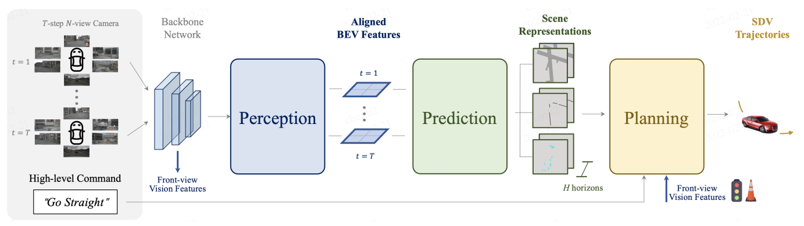
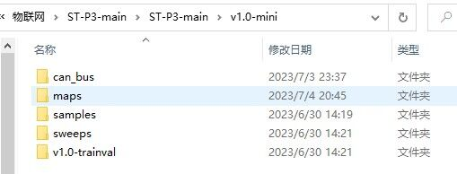

# ST-P3



> **ST-P3: 显示中间表征的环视端到端自动驾驶框架**  

## 介绍

 提出了第一个基于环视相机的，具有**显示**中间表征结果的端到端自动驾驶框架。针对感知-预测-规划三个子模块，其团队分别做了提升时空特征学习性能的特殊设计，包括：基于累积的静态物体特征增加与动态物体特征对齐，结合历史特征变化与未来不确定性建模的双路预测模块，网络前部特征融合提升规划性能。

## 着手开始

### 创建环境

```
conda env create -f environment.yml
git clone https://github.com/OpenPerceptionX/ST-P3.git
```

### 预训练模型

- nuScenes数据集上的开环模型： [模型](https://drive.google.com/file/d/1fPAzrgohTVeFfyXSUh5wUHB_US8v9HFa/view?usp=sharing).
- CARLA模拟器上的闭环模型： [模型](https://drive.google.com/file/d/17KAjamrzlN08XL-NdWkOd2BvpAJ4VZ9M/view?usp=sharing).

### 测试阶段

##### 数据集构建：

下载Full dataset(v1.0)的Trainval与Test（或者下载mini数据集）

将所有数据整合成两个文件夹即samples和sweeps（mini数据集包含map文件夹）

然后下载数据集的CAN bus expansion和Map expansion加入到数据文件夹中

can_bus与samples和sweeps并列放置

map_expansion需要加入到map文件夹中

mini数据集还需将v1.0-mini改名为v1.0-trainval



为了在nuScenes数据集上测试该模型：

-  下载预训练权重。

```
bash scripts/eval_plan.sh ${checkpoint} ${dataroot}
```

为了在Carla模拟器上测试该模型：

- 请参考[Transfuser](https://github.com/autonomousvision/transfuser)来创建并配置相关实验环境；

需要将transfuser里的leaderboard文件夹和scenario_runner文件复制到ST-P3-main文件夹下

还需要将transfuser里的team_code_autopilot文件夹复制，并重命名为team_code， 找到文件夹里的nav_planner.py重命名为planner.py，carla_agent.py的配置才算完成。（注：这一步可能存在问题，因为我们尚不清楚其无法正确运行的原因）

- 使用 `carla_agent.py` 文件以及下载好的预训练权重来测试。

这一步需要修改transfuser里的datagen.sh的设置，具体情况为修改data_agent.py修改为本文的carla_agent.py


### 训练阶段

```
# (推荐) 感知模块预训练
bash scripts/train_perceive.sh ${configs} ${dataroot}

# (可选择) 预测模块训练目标，无需端到端训练
bash scripts/train_prediction.sh ${configs} ${dataroot} ${pretrained}

# 整个模型的端到端训练
bash scripts/train_plan.sh ${configs} ${dataroot} ${pretrained}
```

- 要在nuScenes数据集上从头开始训练模型，建议首先训练感知模块的权重，然后用它来训练后续任务，以防止训练期间出现`nan`报错。
- 如果想要使用nuScenes数据集的深度数据**（即将发布）**，请将深度数据文件夹放入`dataroot`目录中，并将配置文件中的`GT_DEPTH`更改为`True`。

## 性能评估基准

- 在[nuScenes](https://github.com/nutonomy/nuscenes-devkit)数据集上的开环规划结果：

|  Method   | L2 (m) 1s | L2 (m) 2s | L2 (m) 3s | Collision (%) 1s | Collision (%) 2s | Collision (%) 3s |
| :-------: | :-------: | :-------: | :-------: | :--------------: | :--------------: | :--------------: |
|  Vanilla  | **0.50**  | **1.25**  |   2.80    |       0.68       |       0.98       |       2.76       |
|    NMP    |   0.61    |   1.44    |   3.18    |       0.66       |       0.90       |       2.34       |
| Freespace |   0.56    |   1.27    |   3.08    |       0.65       |       0.86       |       1.64       |
| **ST-P3** |   0.87    |   1.27    | **1.69**  |     **0.0**      |     **0.0**      |     **0.13**     |

- 在nuScenes数据集上的开环感知结果（以IoU为度量%）：

|   Method   | Mean Value | Drivable Area |   Lane    |  Vehicle  | Pedestrian |
| :--------: | :--------: | :-----------: | :-------: | :-------: | :--------: |
|    VED     |   28.19    |     60.82     |   16.74   |   23.28   |   11.93    |
|    VPN     |   30.36    |     65.97     |   17.05   |   28.17   |   10.26    |
|    PON     |   30.52    |     63.05     |   17.19   |   27.91   |   13.93    |
| Lift-Splat |   34.61    |     72.23     |   19.98   |   31.22   |   15.02    |
|    IVMP    |   36.76    |     74.70     |   20.94   |   34.03   | **17.38**  |
|   FIERY    |   40.18    |     71.97     |   33.58   | **38.00** |   17.15    |
| **ST-P3**  | **41.64**  |   **77.99**   | **37.91** |   35.37   |   15.27    |

- 在nuScenes数据集上的开环预测结果：

|       Method       | Future Semantic Seg. IoU *↑* | Future PQ *↑* | Instance  SQ *↑* | Seg. RQ *↑* |
| :----------------: | :--------------------------: | :-----------: | :--------------: | :---------: |
|       Static       |            32.20             |     27.64     |      70.05       |    39.08    |
|       FIERY        |            37.00             |     30.20     |      70.20       |    42.90    |
| **ST-P3** **Ber.** |          **37.83**           |   **31.87**   |    **70.36**     |  **44.69**  |

- 在[CARLA](https://github.com/carla-simulator/carla)模拟器上的闭环模拟结果：

<center>Result of RouteScenario_2(receptition 0)</center>

|          Start Time          | 2023-07-05 00:03:19 |
| :--------------------------: | :-----------------: |
|           End Time           | 2023-07-05 00:31:08 |
|    Duration(System Time)     |      1668.66s       |
|     Duration(Game Time)      |       382.95s       |
| Ratio(System Time/Game Time) |        0.229        |

|       Criterion       | Result  |  Value  |
| :-------------------: | :-----: | :-----: |
|  RouteCompletionTest  | SUCCESS |  100%   |
| OutsideRouteLanesTest | SUCCESS |   0%    |
|     CollisionTest     | FAILURE | 1 times |
|  RuningRedLightTest   | SUCCESS | 0 times |
|    RuningStopTest     | SUCCESS | 0 times |
|      InRouteTest      | SUCCESS |         |
|   AgentBlockedTest    | SUCCESS |         |
|        Timeout        | SUCCESS |         |

## 可视化结果

- nuScenes数据集可视化结果

<br/>

- CARLA模拟器可视化结果

  <br/>

  

## 引用
